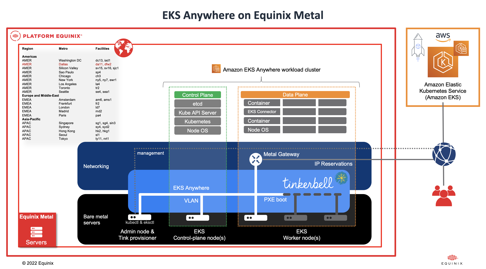

<!-- See https://squidfunk.github.io/mkdocs-material/reference/ -->
# Part 2: Preparing Bare Metal for EKS Anywhere

## High-Level Diagram



## Steps

### 1. Create an EKS-A Admin machine

Using the [metal-cli](https://github.com/equinix/metal-cli):

```sh
metal device create --plan=m3.small.x86 --metro=da --hostname eksa-admin --operating-system ubuntu_20_04
```

### 2. Create a VLAN

```sh
metal vlan create --metro da --description eks-anywhere --vxlan 1000
```

### 3. Create a Public IP Reservation (16 addresses)

Create a Public IP Reservation (16 addresses):

```sh
metal ip request --metro da --type public_ipv4 --quantity 16 --tags eksa
```

These variables will be referred to in later steps in executable snippets to refer to specific addresses within the pool. The correct IP reservation is chosen by looking for and expecting a single IP reservation to have the "eksa" tag applied.

```sh
echo "capture the ID, Network, Gateway, and Netmask using jq"
VLAN_ID=$(metal vlan list -o json | jq -r '.virtual_networks | .[] | select(.vxlan == 1000) | .id')
POOL_ID=$(metal ip list -o json | jq -r '.[] | select(.tags | contains(["eksa"]))? | .id')
POOL_NW=$(metal ip list -o json | jq -r '.[] | select(.tags | contains(["eksa"]))? | .network')
POOL_GW=$(metal ip list -o json | jq -r '.[] | select(.tags | contains(["eksa"]))? | .gateway')
POOL_NM=$(metal ip list -o json | jq -r '.[] | select(.tags | contains(["eksa"]))? | .netmask')
echo "define POOL_ADMIN - ip assigned to eksa-admin within the VLAN"
POOL_ADMIN=$(python3 -c 'import ipaddress; print(str(ipaddress.IPv4Address("'${POOL_GW}'")+1))')
echo "define PUB_ADMIN - provisioned IPv4 public address of eks-admin which we can use with ssh"
PUB_ADMIN=$(metal devices list  -o json  | jq -r '.[] | select(.hostname=="eksa-admin") | .ip_addresses [] | select(contains({"public":true,"address_family":4})) | .address')
echo "define PORT_ADMIN - the bond0 port of the eks-admin machine"
PORT_ADMIN=$(metal devices list  -o json  | jq -r '.[] | select(.hostname=="eksa-admin") | .network_ports [] | select(.name == "bond0") | .id')
echo "define POOL_VIP - the floating IPv4 public address assigned to the current lead kubernetes control plane"
POOL_VIP=$(python3 -c 'import ipaddress; print(str(ipaddress.ip_network("'${POOL_NW}'/'${POOL_NM}'").broadcast_address-1))')
echo "define TINK_VIP - Tinkerbell Host IP"
TINK_VIP=$(python3 -c 'import ipaddress; print(str(ipaddress.ip_network("'${POOL_NW}'/'${POOL_NM}'").broadcast_address-2))')
```

### 4. Create a Metal Gateway

```sh
metal gateway create --ip-reservation-id $POOL_ID --virtual-network $VLAN_ID
```

### 5. Create Tinkerbell worker nodes 

Create two Metal devices `eksa-node-001` - `eksa-node-002` with Custom IPXE <http://{eks-a-public-address>}. These nodes will be provisioned as EKS-A Control Plane *OR* Worker nodes.

```sh
for a in {1..2}; do
  metal device create --plan m3.small.x86 --metro da --hostname eksa-node-00$a \
  --ipxe-script-url http://$POOL_ADMIN/ipxe/  --operating-system custom_ipxe
done
```

> **_Note:_** that the `ipxe-script-url` doesn't actually get used in this process, we're just setting it as it's a requirement for using the custom_ipxe operating system type.

### 6. Network configuration

#### 6.1. Add the vlan to the eks-admin bond0 port

```sh
metal port vlan -i $PORT_ADMIN -a $VLAN_ID
```

Configure the layer 2 vlan network on eks-admin with this snippet:

```sh
ssh root@$PUB_ADMIN tee -a /etc/network/interfaces << EOS

auto bond0.1000
iface bond0.1000 inet static
  pre-up sleep 5
  address $POOL_ADMIN
  netmask $POOL_NM
  vlan-raw-device bond0
EOS
```

Activate the layer 2 vlan network with this command:

```sh
ssh root@$PUB_ADMIN systemctl restart networking
```

#### 6.2. Convert `eksa-node-*` 's network ports to Layer2-Unbonded and attach to the VLAN.

> **_Note:_** The `eksa-node-*` nodes must be fulling provisioned before running this step.

```sh
node_ids=$(metal devices list -o json | jq -r '.[] | select(.hostname | startswith("eksa-node")) | .id')

i=1
for id in $(echo $node_ids); do
  let i++
  BOND0_PORT=$(metal devices get -i $id -o json  | jq -r '.network_ports [] | select(.name == "bond0") | .id')
  ETH0_PORT=$(metal devices get -i $id -o json  | jq -r '.network_ports [] | select(.name == "eth0") | .id')
  metal port convert -i $BOND0_PORT --layer2 --bonded=false --force
  metal port vlan -i $ETH0_PORT -a $VLAN_ID
done
```

### 7. Prepare hardware inventory

Capture the MAC Addresses and create `hardware.csv` file on `eks-admin` in `/root/` (run this on the host with metal cli on it):
   
Create the CSV Header:

```sh
echo hostname,vendor,mac,ip_address,gateway,netmask,nameservers,disk,labels > hardware.csv
```

Use `metal` and `jq` to grab HW MAC addresses and add them to the hardware.csv:

> **_Note:_** below command assumes you are launching a single control-plane node. For HA you may need to change
> the `if [ "$i" = 1 ];` condition to something like `if [ "$i" <= 3 ];`
> (the number will depend on your setup, usually 3 or 5 cp nodes)

```sh
node_ids=$(metal devices list -o json | jq -r '.[] | select(.hostname | startswith("eksa-node")) | .id')

i=1
for id in $(echo $node_ids); do
  if [ "$i" = 1 ]; then TYPE=cp; else TYPE=worker; fi;
  NODENAME="eks-node-00$i"
  let i++
  MAC=$(metal device get -i $id -o json | jq -r '.network_ports | .[] | select(.name == "eth0") | .data.mac')
  IP=$(python3 -c 'import ipaddress; print(str(ipaddress.IPv4Address("'${POOL_GW}'")+'$i'))')
  echo "$NODENAME,Equinix,${MAC},${IP},${POOL_GW},${POOL_NM},8.8.8.8|8.8.4.4,/dev/sda,type=${TYPE}" >> hardware.csv
done
```

The BMC fields are omitted because Equinix Metal does not expose the BMC of nodes. EKS Anywhere will skip BMC steps with this configuration.

Copy `hardware.csv` to `eksa-admin`:

```sh
scp hardware.csv root@$PUB_ADMIN:/root
```

We've now provided the `eksa-admin` machine with all of the variables and configuration needed in preparation.

## Discussion

Before proceeding to the next part let's take a few minutes to discuss what we did. Here are some questions to start the discussion.

* Are there other network configurations available? 
